# 计算机网络

#### TCP/IP 五层协议

Layer 1

* byte/bit

Layer 2

* Frame

Layer 3 网络层

* 路由选择（使用哪一个链路）
* 监督信息在站点的传递
* Packet

Layer 4 运输层

* 两端站点的监督
* 同 IP 下不同的分发，网络地址的复用 port
* Message

Layer 5 应用层

除此之外，还有 TCP/IP 四层协议以及 OSI 七层模型

## The Physical Layer

### Transmission

#### Guided transmission media

##### Persistent Storage

简单粗暴装到存储装置中物理传输

##### Twisted Pairs 双绞线

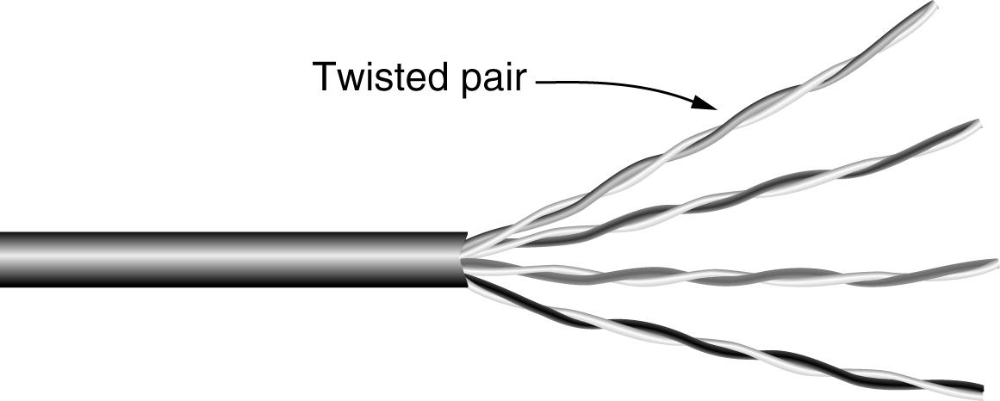

##### Coaxial Cable 同轴电缆

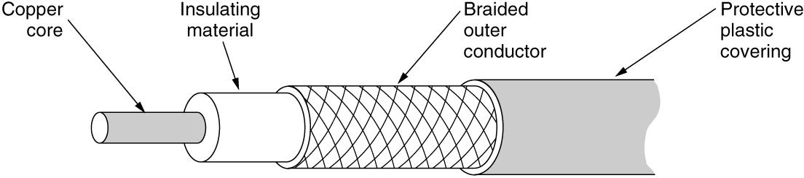

##### Power lines 电缆

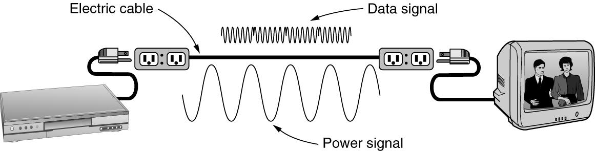

##### Fiber Optics 光缆

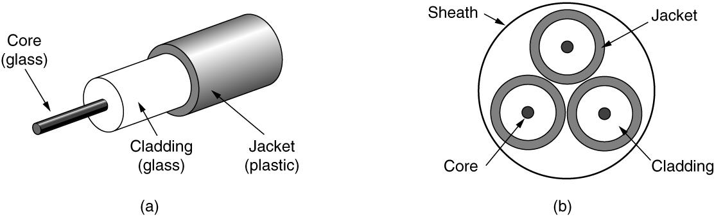

#### Wireless Transmission

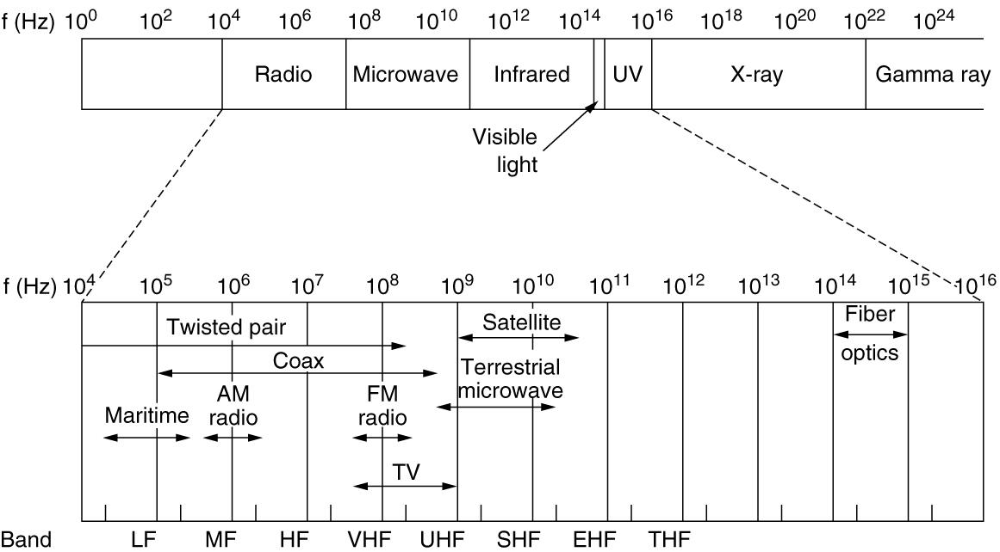

频率越高，带宽越高

##### Radio Transmission

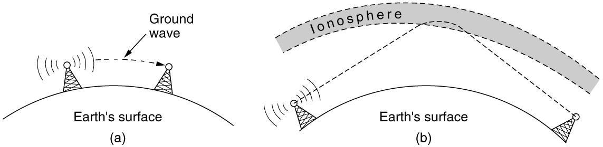

短波可以利用电离层反射

* Communication Satallites

  利用卫星做反射端，可以利用除短波以外的波

......

### Encoding and decoding

Bandwidth 带宽

* 信道带宽则是信道能通过的最高频率和最低频率之差。

baseband 在频谱中没有调制的信号，其频率范围通常是从零赫兹开始到某一特定的最高频率。

passband 特定频率范围内的信号能够有效传输的频带

**The Maximum Data Rate of a Channel**  ?

Nyquist's theorem
* Maximum data rate = 2 Blog~2~ V bits/sec
* 为了避免失真，信号的采样频率必须至少是信号带宽（最高频率成分）的两倍。
* V 是信号的离散电平数量。这指的是信号在传输过程中可以取的不同值或状态数量。
* 就是传来了一个信号，我对它进行 2B 的采样，（将模拟信号转化成数字信号）每个采样点的信号代表了 log2 V bit

Shannon’s formula for capacity of a noisy channel
* Maximum data rate = B log~2~ (1 + S/N) bits/sec
* S/N 信噪比

#### Baseband Transmission 

在原始频率范围内直接传输

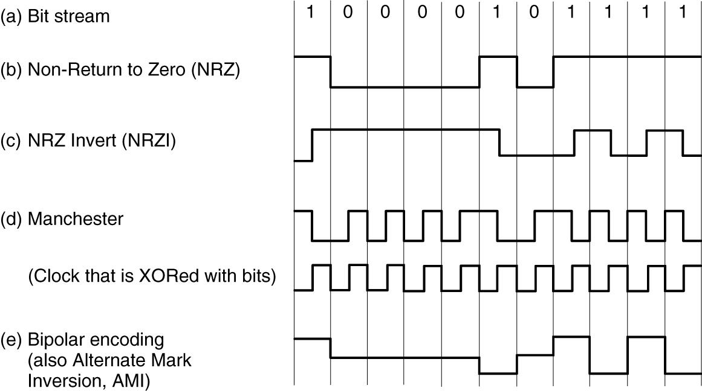

**标准电信曼彻斯特编码**：

- **0**：先为低电平，再变为高电平。
- **1**：先为高电平，再变为低电平。

#### Passband Transmission

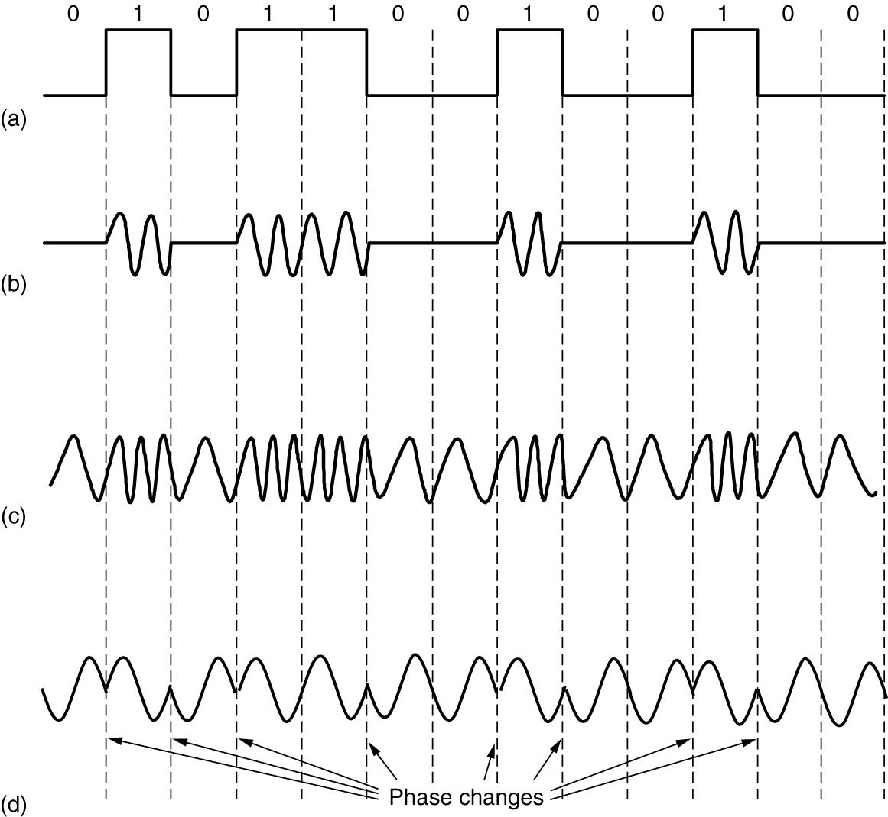

改变相位，幅度，频率来代表不同的信息

下图用相位的变化来表示不同的信息

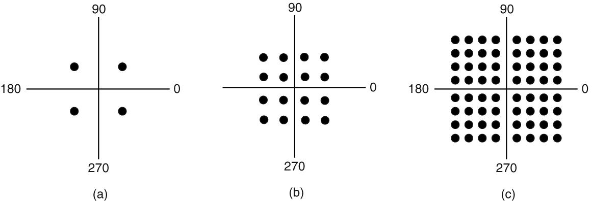

### Multiplexing

#### Frequency Division Multiplexing

#### Time Division Multiplexing

#### Code Division Multiplexing

由于信号之间的正交，可以从中提取到自己想要的信号

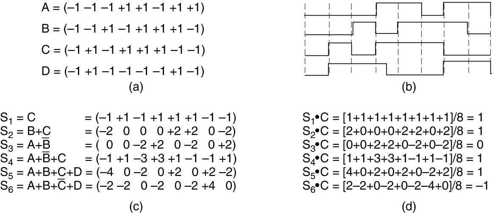

#### Wavelength Division Multiplexing 

波长，用于光纤

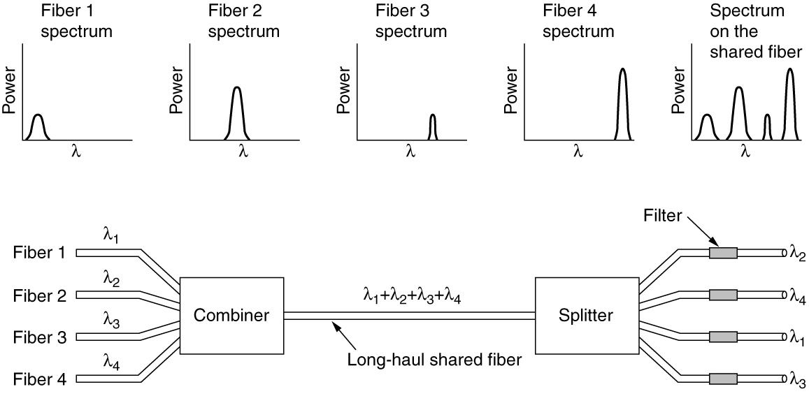

### Telephone modem

在电话线上进行信号的传输

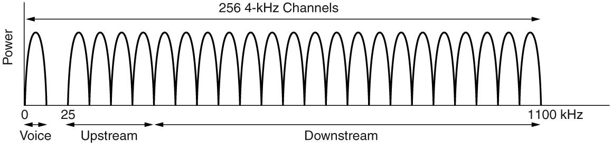

通过分频实现频率的复用

### Switching

* Circuit switching: traditional telephone system 电路交换
* Packet switching: voice over IP technology 分组交换
