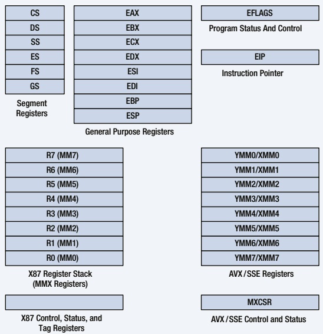
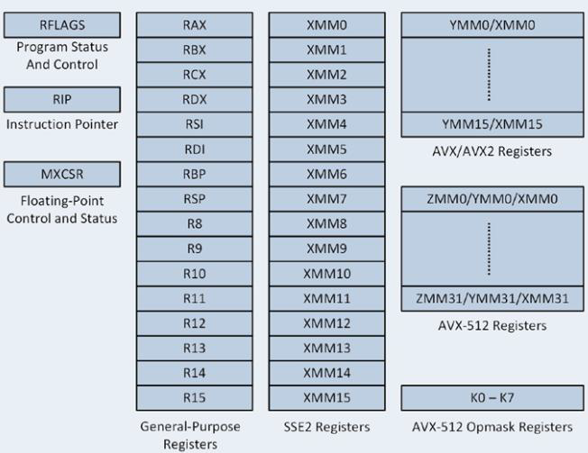
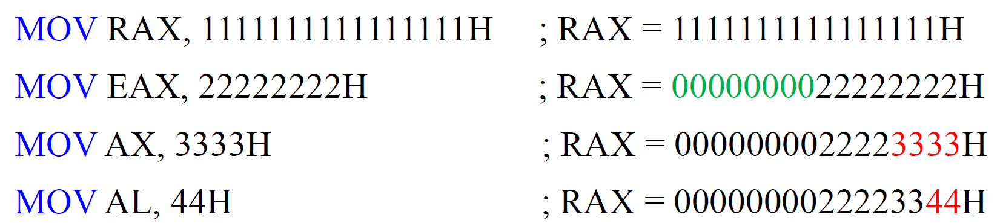
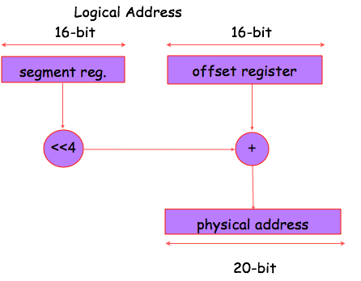
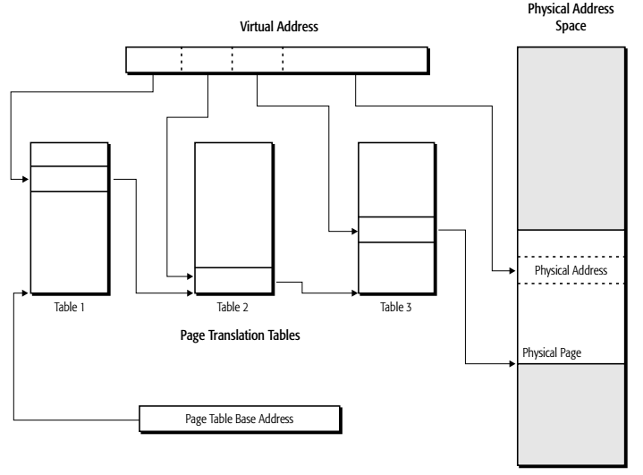

# 汇编与接口

## Chapter 2
### IA-32 Basic Executuion Environment

### 64-Bit Mode Execution Environment

### General-Purpose Registers
RAX - a 64-bit register (RAX), a 32-bit register (accumulator) (EAX), a 16-bit register (AX), or as either of two 8-bit registers (AH and AL).

memory protection but may cause false dependence

RBX, addressable as RBX, EBX, BX, BH, BL.
> BX register (base index) sometimes holds offset address of a location in the memory system in all versions of the microprocessor

RCX, as RCX, ECX, CX, CH, or CL.
> a (count) general-purpose register that also holds the count for various instructions

RDX, as RDX, EDX, DX, DH, or DL.
> a (data) general-purpose register

> holds a part of the result from a multiplication or part of dividend before a division

RBP, as RBP, EBP, or BP.
> points to a memory (base pointer) location for memory data transfers
•
RDI addressable as RDI, EDI, or DI.
> often addresses (destination index) string destination data for the string instructions

RSI used as RSI, ESI, or SI.
> the (source index) register addresses source string data for the string instructions

> like RDI, RSI also functions as a general- purpose register

R8 - R15 found in the Pentium 4 and Core2 if 64-bit extensions are enabled. For most instructions, access to the extended GPRs requires a REX prefix.

In 64-bit mode, general-purpose registers include:
> 16 8-bit low-byte registers: AL, BL, CL, DL, SIL, DIL, BPL, SPL, R8B-R15B

> 4 8-bit high-byte registers: AH, BH, CH, DH, addressable only when no REX prefix is used

> 16 16-bit registers: AX, BX, CX, DX, DI, SI, BP, SP, R8W-R15W

> 16 32-bit registers: EAX, EBX, ECX, EDX, EDI, ESI, EBP, ESP, R8D-R15D

> 16 64-bit registers: RAX, RBX, RCX, RDX, RDI, RSI, RBP, RSP, R8-R15

### Special-Purpose Registers

RIP addresses the next instruction in a section of memory.
> defined as (instruction pointer) a code segment

RSP addresses an area of memory called the stack.
> the (stack pointer) stores data through this pointer

RFLAGS indicate the condition of the microprocessor and control its operation.

> Status Flags of the RFLAGS
>> C (bit 0): Carry flag holds the carry after addition or borrow after subtraction.

>> Z (bit 6): Zero flag shows that the result of an arithmetic or logic operation is zero.

>> S (bit 7): Sign flag holds the arithmetic sign of the result after an arithmetic or logic instruction executes.

>> O (bit 11): Overflow flag occurs when signed numbers are added or subtracted.
>>> an overflow indicates the result has exceeded the capacity of the machine

>> P (bit 2): Parity flag is set if the least-significant byte of the result contains an even number of 1 bits; cleared otherwise (parity even PF=1; parity odd PF=0).

>> A (bit 4): Auxiliary carry holds the carry (half-carry) after addition or the borrow after BCD operations between bit positions 3 and 4 of the result

>> D (direction) selects increment or decrement mode for the DI and/or SI registers.

> System Flags of the RFLAGS

>> T (trap) The trap flag enables trapping through an on-chip debugging feature.

>> I (interrupt) controls operation of the INTR (interrupt request) input pin.

>> VM (virtual mode) flag bit selects virtual mode operation in a protected mode system.

>> IOPL used in protected mode operation to select the privilege level for I/O devices.

>> NT (nested task) flag indicates the current task is nested within another task in protected mode operation.

>> AC (alignment check) flag bit activates if a word or doubleword is addressed on a non-word or non-doubleword boundary.

>> RF (resume) used with debugging to control resumption of execution after the next instruction.

>> ID (identification) flag indicates that the Pentium microprocessors support the CPUID instruction.

>>> CPUID instruction provides the system with information about the Pentium microprocessor

>> VIF is a copy of the interrupt flag bit available to the Pentium 4–(virtual interrupt)

>> VIP (virtual) provides information about a virtual mode interrupt for (interrupt pending) Pentium.

>>> used in multitasking environments to provide virtual interrupt flags

### Segment Registers

CS (code) segment holds code (programs and procedures) used by the microprocessor.

DS (data) contains most data used by a program.
> Data are accessed by an offset address or contents of other registers that hold the offset address

ES (extra) an additional data segment used by some instructions to hold destination data.

......

### Memory Managemnet Requirements

#### Relocation

logical address and physical address

Segmentation and Paging

##### Real Mode memeory addressing

### 2-6 Memory Paging

Effective addresses, or segment offsets

Logical addresses

Linear (virtual) addresses

Physical addresses

