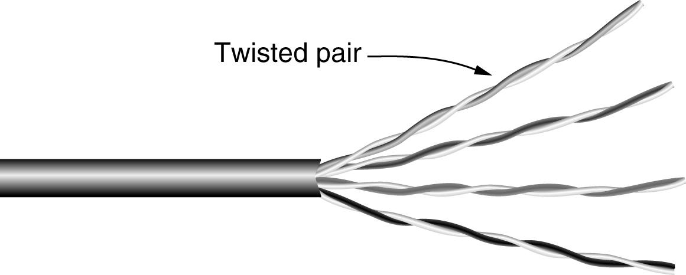
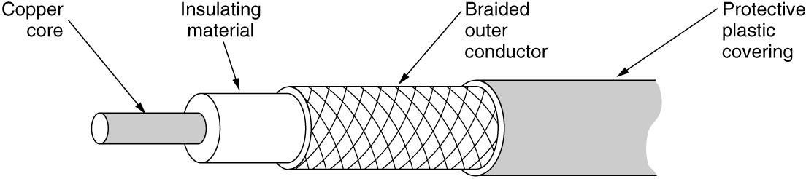
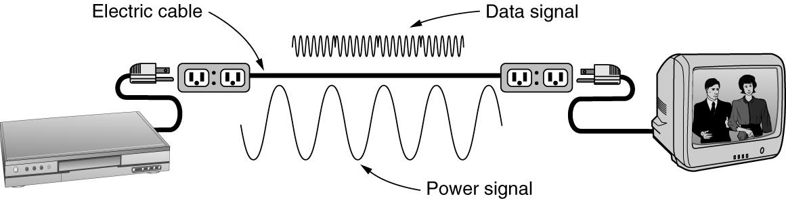

# 计算机网络

Mobile network

* 3G, 4G, 5G

Wireless networks (WiFi)

基站切换 硬切换和软切换（双份连接）

#### TCP/IP 五层协议

Layer 1 
* byte/bit

Layer 2
* Frame

Layer 3 网络层
* 路由选择（使用哪一个链路）
* 监督信息在站点的传递
* Packet

Layer 4 运输层
* 两端站点的监督
* 同 IP 下不同的分发，网络地址的复用 port
* Message

Layer 5 应用层

除此之外，还有 TCP/IP 四层协议以及 OSI 七层模型

#### Guided transmission media

##### Twisted Pairs 双绞线

##### Coaxial Cable 

##### Power lines 电缆

##### Fiber Optics 光缆

#### Wireless Transmission

频率越高，带宽越高

##### Radio Transmission

短波可以利用电离层反射

##### Communication Satallites

利用卫星做反射端，可以利用除短波以外的波

......

#### wave to bit

Bandwidth = 最高允许频率 - 最低允许频率

baseband 基带信号

passband 经过调制后的信号

采样 - 信号损失 - 传输速度 $ \uparrow $

The Maximum Data Rate of a Channel
* baud 波特 每秒传输的数据 
* given bandwidth W, baud = 2W
* 采样频率 2W
* 多进制编码，在信号传输不变的情况下，提高数据传输

Nyquist's theorem
* Maximum data rate = 2 $Blog_2 V$ bits/sec

Shannon’s formula for capacity of a noisy channel
* Maximum data rate = $B log_2 (1 + S/N)$ bits/sec
* S/N 信噪比

##### Baseband Transmission

Manchester - 1:0.5 - 希望信号产生跳变

##### Passband Transmission

Passband transmission refers to the method of transmitting data by modulating a carrier signal within a specific frequency range, known as the passband. This technique is widely used in various communication systems, including radio, television, and digital communication networks.

(a) A binary signal: This represents the original digital data, typically consisting of a series of 0s and 1s. Binary signals are the foundation of digital communication.

(b) Amplitude Shift Keying (ASK): In ASK, the amplitude of the carrier signal is varied in accordance with the binary data. For example, a higher amplitude might represent a binary 1, while a lower amplitude represents a binary 0. This method is simple but can be susceptible to noise and interference.

(c) Frequency Shift Keying (FSK): FSK involves changing the frequency of the carrier signal to represent binary data. Different frequencies are used to represent binary 0s and 1s. FSK is more robust against noise compared to ASK and is commonly used in applications like modems and radio transmission.

(d) Phase Shift Keying (PSK): In PSK, the phase of the carrier signal is altered to encode the binary data. Different phase shifts represent different binary values. PSK is highly efficient and can be used to transmit data at higher rates. Variants of PSK, such as Quadrature Phase Shift Keying (QPSK), can encode multiple bits per symbol, further increasing the data rate.

In summary, passband transmission and its various modulation techniques are essential for efficient and reliable data communication, enabling the transmission of digital information over different types of media.

